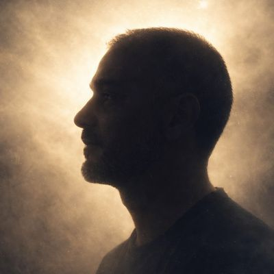
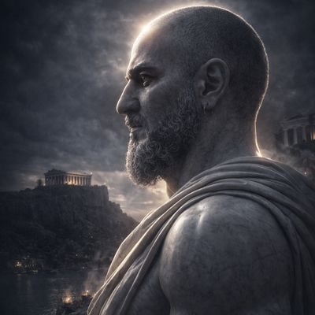
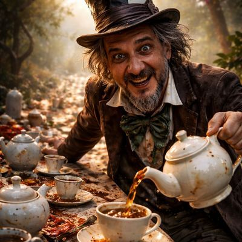
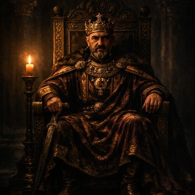

# Prompts para imagens

Segue alguns prompts para imagens com IA

## Onde usar?
- ChatGpt https://chatgpt.com/
- Gemini https://gemini.google.com/

## Como utilizar

Anexe uma arquivo de foto na IA e cole um dos prompts abaixo:

## 1. <p align="center"></p>
```
Exquisite high fashion photography of a surreal and vibrant cinematic photo of a lone male silhouette with defined dark contours and minimal facial features including subtle nose and lip curves gently rising into soft white-gold light, mist and fog, celestial glow, minimalistic composition, vast empty space, soft gradients, spiritual rebirth mood, cinematic lighting, ultra clean, atmospheric haze, holy and peaceful atmosphere, surreal photography, photorealistic, film grain, with the silhouette's skin a deep shadowy tone and the surrounding light a warm golden hue, inviting a sense of serenity and wonder, the silhouette's dark hair barely visible against the dark tones of his skin, the overall scene evoking a sense of ethereal calmness and mystical renewal. ar 4:5 

```
```
Fotografia de alta moda requintada, surreal e vibrante, em estilo cinematográfico, de uma silhueta masculina solitária com contornos escuros definidos e traços faciais mínimos, incluindo curvas sutis no nariz e nos lábios, que se elevam suavemente em direção a uma luz branco-dourada, névoa e bruma, brilho celestial, composição minimalista, vasto espaço vazio, gradientes suaves, atmosfera de renascimento espiritual, iluminação cinematográfica, ultra limpa, névoa atmosférica, atmosfera sagrada e pacífica, fotografia surreal, fotorrealista, granulação de filme, com a pele da silhueta em um tom profundo e sombrio e a luz ao redor em um tom dourado quente, convidando a uma sensação de serenidade e admiração, o cabelo escuro da silhueta mal visível contra os tons escuros de sua pele, a cena geral evocando uma sensação de calma etérea e renovação mística. ar 4:5
```
## 2. <p align="center"></p>
```
Cinematic 8K hyper-realistic, stoic marble statue, Greece in the background, dark background, Greek mythology, colossal, illuminated by a radiant light, ultra detailed, is characterized by its extraordinary physical attributes and awe-inspiring presence. ar 3:4 
```
```
Estátua de mármore estoica hiper-realista em 8K, com a Grécia ao fundo, em um cenário escuro, inspirada na mitologia grega. A figura é colossal, iluminada por uma luz radiante e ultradetalhada, caracterizando-se por seus atributos físicos extraordinários e presença imponente. Proporção 3:4.
```
## 3. <p align="center"></p>
```
A wild-eyed man with messy hair and a tall worn top hat labeled "10/6" sits at a long chaotic tea table outdoors, covered in mismatched teacups and teapots. He wears rumpled formal clothing stained with tea, expression manic and unpredictable. He leans forward with an intense grin while pouring tea into an already full cup, liquid overflowing. Strange whimsical setting with eerie undertone, cluttered table stretching into distance, ultra-realistic, cinematic lighting, no text ar 4:5 
```
```
Um homem de olhar selvagem, cabelos despenteados e uma cartola alta e gasta com a inscrição "10/6" está sentado em uma longa e caótica mesa de chá ao ar livre, coberta por xícaras e bules de chá desparelhos. Ele veste roupas formais amarrotadas e manchadas de chá, com uma expressão maníaca e imprevisível. Inclina-se para a frente com um sorriso intenso enquanto serve chá em uma xícara já cheia, transbordando o líquido. Cenário estranho e fantasioso com um tom misterioso, mesa desarrumada que se estende ao longe, iluminação ultrarrealista e cinematográfica, sem texto. Formato 4:5.
```
## 4. <p align="center"></p>
```
Lone figure of a Byzantine emperor sitting on a throne in an empty dark hall, single candle flame, long shadows, heavy crown, sense of power and conquership, cinematic composition, dark historical atmosphere ar 4:5 
```
```
Figura solitária de um imperador bizantino sentado em um trono em um salão escuro e vazio, chama de uma única vela, longas sombras, coroa pesada, sensação de poder e conquista, composição cinematográfica, atmosfera histórica sombria, formato 4:5.
```